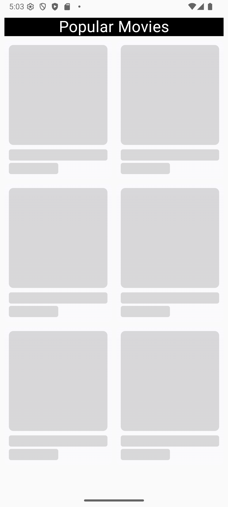
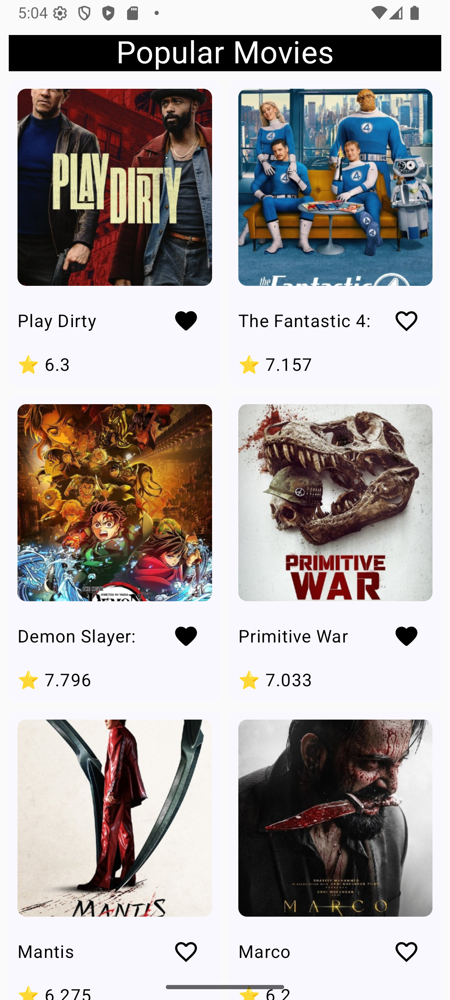

# MovieDemo Android App 🎬

A modern Android app demonstrating best practices in **Jetpack Compose**, **Clean Architecture**, and **offline-first design**. The app fetches and displays popular movies using a **REST API** while supporting **paging, favorites, and offline caching**.

---

## Features ✨

- Display movies in a **grid layout** with **image, title, rating, and favorite toggle**
- **Offline-first** using **Room Database** as a single source of truth (SSOT)
- **Paging 3** for efficient data loading with support for **infinite scrolling**
- **Skeleton loading UI** for better user experience while fetching data
- **Favorite movies** persisted locally in Room
- **Navigation** using Jetpack Navigation Compose
- Clean and modular **feature-based architecture**
- **MVI pattern** using **ViewModel + UI Contract (Event, State, Effect)**
- **Custom wrapper Resource** for handling **Loading / Success / Error** states
- **Retrofit** for API calls
- API key and base URL managed via **BuildConfig**

---

## Architecture 🏗️

This project follows a **feature-based Clean Architecture** approach:

APP (MAIN)
CORE (DATA, DOMAIN, DESIGN)
FEATURE (LIST)

### Key Patterns

- **Single Source of Truth (SSOT)** → Room is the canonical data source; network updates refresh the DB
- **MVI Pattern**:
    - **Event** → triggers actions in ViewModel
    - **State** → represents UI state
    - **Effect** → one-time events like Snackbars or navigation
- **Resource Wrapper**: Handles loading, success, and error states consistently

---

## Libraries & Tools 🛠️

- [Jetpack Compose](https://developer.android.com/jetpack/compose) – UI toolkit
- [Paging 3](https://developer.android.com/topic/libraries/architecture/paging/v3-overview) – Lazy loading with pagination
- [Room](https://developer.android.com/training/data-storage/room) – Offline persistence
- [Retrofit](https://square.github.io/retrofit/) – API calls
- [Hilt](https://developer.android.com/training/dependency-injection/hilt-android) – Dependency injection
- [Navigation Compose](https://developer.android.com/jetpack/compose/navigation) – In-app navigation
- BuildConfig – API key and base URL management

---

## How It Works 🚀

1. **Network + DB Flow**
    - `Retrofit` fetches data from API
    - Data is stored in `Room` database
    - Paging 3 observes Room and emits UI-friendly paging data

2. **Favorites**
    - User toggles favorite → updates Room → UI reflects immediately via **local state**

3. **MVI Flow**
    - User action → Event → ViewModel → State update → Composable recompose → Effect for one-time actions

4. **Offline-First**
    - The app continues to display movies from Room when offline
    - Paging + Room ensures **smooth scrolling** without network dependency

---

## Screenshots 📸

<p align="center">
  
  
  
</p>

---

## Setup 🔧

1. Clone the repository:

```bash
git clone https://github.com/yourusername/moviedemo.git
cd moviedemo
```

2. Add your API key and base URL in local.properties:
```bash
MOVIE_API_KEY="your_api_key_here"
MOVIE_BASE_URL="https://api.themoviedb.org/3/"
```

3. Build and run the app in Android Studio.

## License

This project is licensed under the MIT License – see the LICENSE
file for details.
